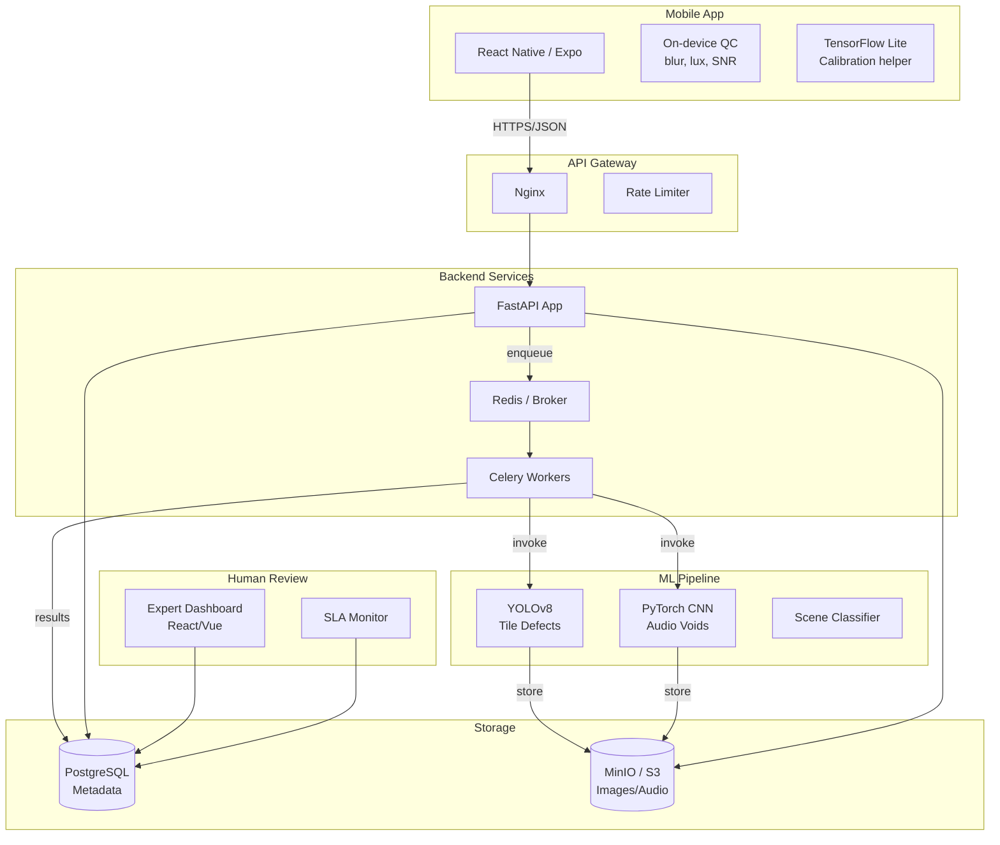

# Архитектура СтройКонтроль AI v2.1

## Общая схема

## Компоненты

### Mobile App (React Native + Expo)
- **Калибровка:** On-device CV через TensorFlow Lite Lite для распознавания монеты/карты/A4. Fallback — ручной ввод.
- **Контроль качества снимка:** Размытость (Laplacian variance), освещенность (lux estimation через EXIF + sensor), проверка бликов (highlight detection).
- **Съемка:** Overlay-сетка для ровной съемки. Минимум 3 фото (фронт, лево 30°, право 30°).
- **Аудио:** Запись фона (3 сек) + серия простукиваний по сетке 3×3.
- **Градация устройств:**
  - Class A: AR, LiDAR, 3D-анализ включены
  - Class B: AR ограничен, без LiDAR
  - Class C: только базовые функции

### Backend (FastAPI)
- **Auth:** OTP через SMS (СМСЦ / YooKassa / мок)
- **Projects:** CRUD + статусная машина (draft → calibration → capturing → analyzing → human_review → completed)
- **Payments:** YooKassa, Apple Pay, Google Pay, СБП
- **Analysis queue:** Celery + Redis для async ML pipeline
- **Human review queue:** SLA monitoring per tariff

### ML Pipeline
- **Scene Classifier:** ResNet/EfficientNet — классификация сцены (стена/пол/узел примыкания)
- **Tile Defect Detector:** YOLOv8 — детекция дефектов геометрии
  - Неравномерные швы
  - Ступеньки (перепад высоты)
  - Пустоты (визуальные признаки)
  - Отсутствие деформационного шва
- **Audio Void Classifier:** CNN на mel-спектрограммах — классификация "пустота / норма"
- **Calibration Validator:** Измерение ширины шва в 3+ местах, проверка 20% разброса

### Human-in-the-Loop
- **Expert Dashboard:** Просмотр спорных фото, вынесение вердикта
- **SLA:**
  - B2B: ≤15 минут
  - B2C: ≤2 часа
  - PAYG/Free: ≤24 часа
- **Active Learning:** Спорные случаи ("ИИ ошибся?") попадают в выборку для дообучения

## Поток данных

### MVP Сценарий: Плитка керамическая

1. **Регистрация** → SMS OTP
2. **Создание проекта** → выбор комнаты/поверхности
3. **Калибровка** → распознавание эталона → проверка
4. **Съемка** → 3 фото + аудио (фон + 9 простуков)
5. **AI-анализ** → CV + Audio параллельно
6. **Human review** (если confidence < 0.85)
7. **Генерация отчета** → PDF с разметкой + SNiP ссылки
8. **Экспорт** → скачивание / шаринг

## База данных

### Основные таблицы
- `users` — пользователи, consent, тарифы
- `projects` — проекты, статусы, калибровка
- `photos` — фото, метаданные, качество
- `audio_samples` — аудиозаписи, SNR, классификация
- `defects` — дефекты, confidence, expert review
- `payments` — платежи, статусы
- `expert_review_queue` — очередь на ручную проверку

## Масштабирование

### Phase 1 (MVP, 0-8 мес)
- Docker Compose на одном сервере
- PostgreSQL + MinIO на одном инстансе
- ML inference inline (Celery worker на CPU)

### Phase 2 (10-15 мес)
- Kubernetes для stateless сервисов
- GPU nodes для ML inference
- CDN для фото/отчетов

### Phase 3 (20-24 мес)
- Multi-region (РФ: Москва, Питер, Екатеринбург)
- Auto-scaling ML workers
- Separate read replicas

## Безопасность и 152-ФЗ

- Все данные в контуре РФ
- Шифрование at rest (AES-256) и in transit (TLS 1.3)
- Явный consent при регистрации
- Возможность полного удаления данных (GDPR/152-ФЗ "право на забвение")
- Логирование доступа к персональным данным
- Регулярные бэкапы с шифрованием

## Интеграции

| Сервис | Назначение |
|--------|-----------|
| YooKassa | Платежи, подписки |
| СМСЦ.ru | SMS-рассылка OTP |
| MinIO / S3 | Хранение фото/аудио/отчетов |
| Telegram Bot | Уведомления экспертам |

## Технические метрики

| Метрика | Цель MVP | Цель Beta |
|---------|---------|-----------|
| CV Precision | ≥75% | ≥85% |
| CV Recall | ≥70% | ≥80% |
| Audio Accuracy | ≥85% | ≥90% |
| SLA B2B | ≤30 сек | ≤30 сек |
| SLA B2C | ≤60 сек | ≤60 сек |
| Human review SLA | ≤15 мин (B2B) | ≤15 мин |
| Inter-annotator agreement | κ≥0.8 | κ≥0.85 |
